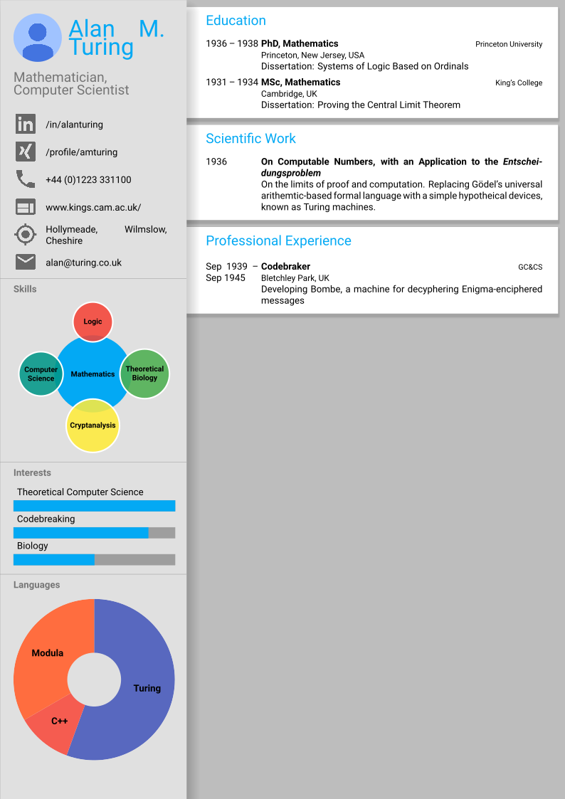

# LaTeX resume template
Beautiful, concise resume adhering to Google's Material design language. Based on [Harshavardhan Gadgil's CV](https://github.com/opensorceror/Data-Engineer-Resume-LaTeX).



## Prerequesites

Requires the Roboto font family to be visible to LaTeX and XeLaTeX to compile. A standard texlive environment should contain all necessary pacakges.
XeLaTeX may require two runs before rendering everyting correctly.

## License

```
Copyright 2017 Philip Abernethy

Licensed under the Apache License, Version 2.0 (the "License");
you may not use this file except in compliance with the License.
You may obtain a copy of the License at

   http://www.apache.org/licenses/LICENSE-2.0

Unless required by applicable law or agreed to in writing, software
distributed under the License is distributed on an "AS IS" BASIS,
WITHOUT WARRANTIES OR CONDITIONS OF ANY KIND, either express or implied.
See the License for the specific language governing permissions and
limitations under the License.
```

